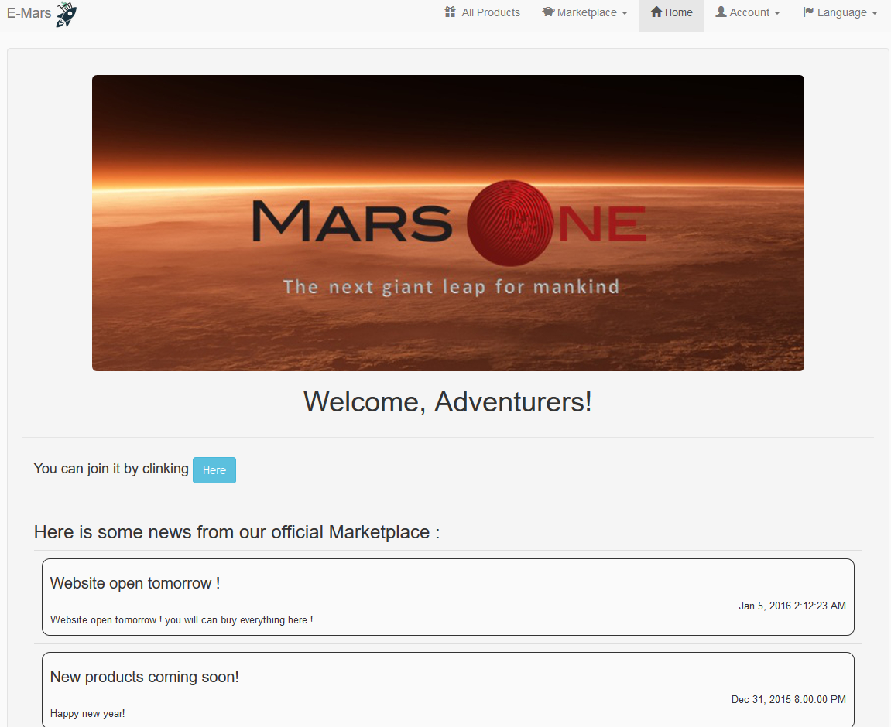
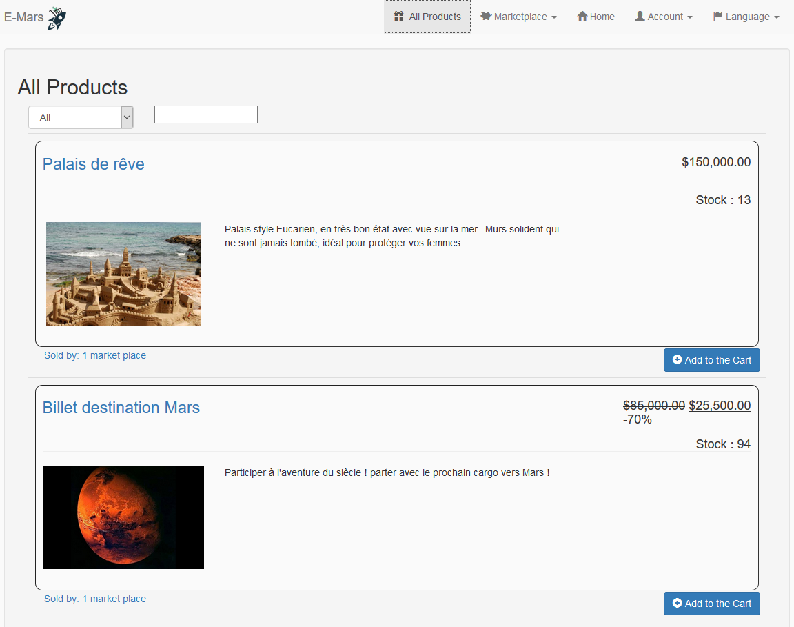
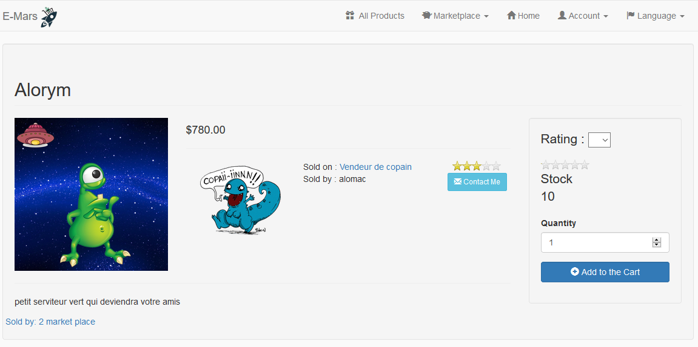
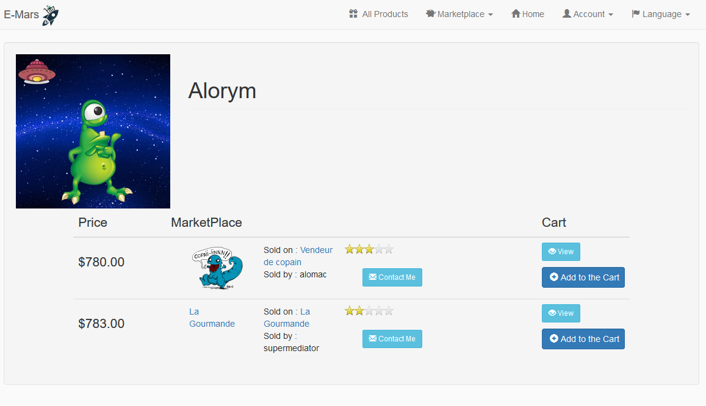
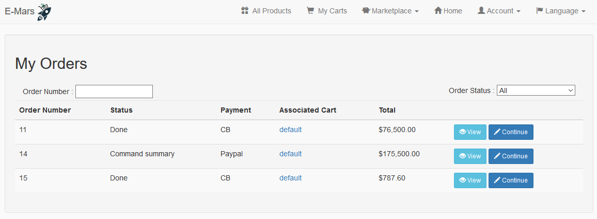
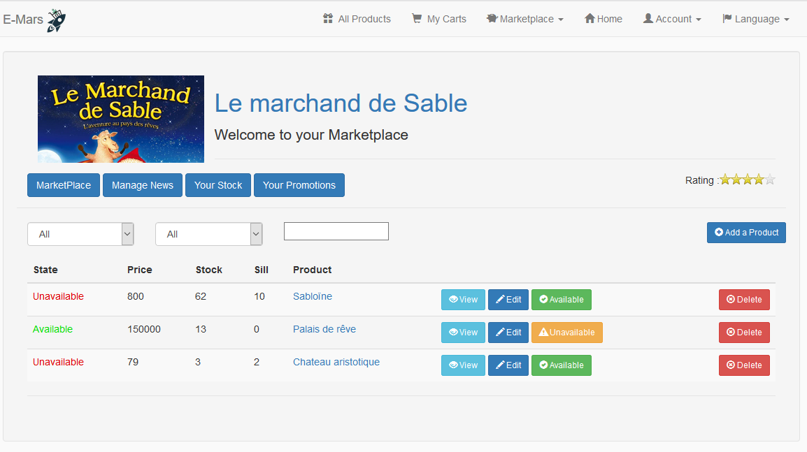
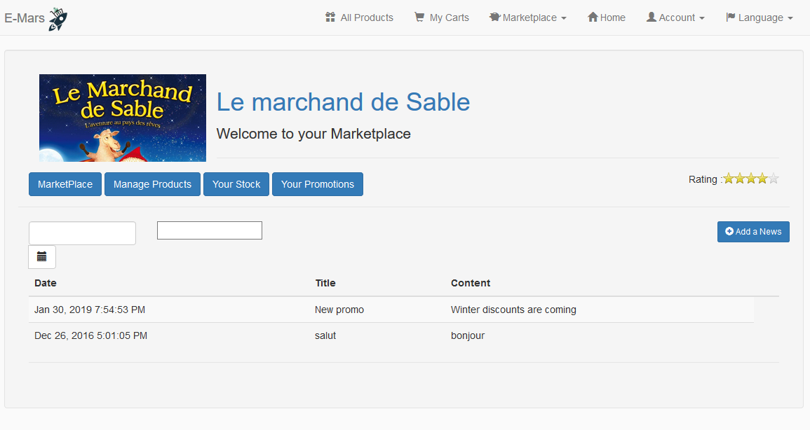

# JWeb

JWeb is an eCommerce website created by myself for a Java class at Epitech.

I had to use Java and AngularJS with JHipster (which is a project generator).

The website is fully operational with an email server and external database. In order to run this project, a MySQL server should be turned on and a database named jweb has to be created, I have used WampServer. The project will automatically create the tables thanks to Hibernate.

The website contains a customer and a seller side. Only the final payment process is not implemented.

The project deserves a public API with a detailled documentation (available with admin access).

-------------------------------------------------------------------------------------------  
## Functionalities

###### General
- login
- email available (notification, change password)
- multi language (actually french and english : i18n)

###### Admin access (from website)
- manage entities with UI for each components
- user management
- Metrics / Health / Audits configured thanks to JHipster
- Logs
- API documentation 

###### Client
- access to a list of products
- search by key / sort products
- access to the detail of the product
- possibility to compare the price of a same product for different seller in the detail page
- possibility to create multiple cart with names
- add a product to a cart (a cart is created if none exist)
- purchase an order
- orders can be managed in the Orders page, an order will be saved at each step, so the customer can finalize it later
- access to the list of all marketplaces
- access to a presentation page of each marketplace
- possibility to follow a marketplace

###### Seller
- manage marketplace description
- add product
- manage product : price / detail / stock
- possibility to delete or put as unavailable a product
- add a discount on a product or a range of product (type, category...)
- add news: it will be notified on the home page of the customers who follow you

-------------------------------------------------------------------------------------------  
## Component:  

###### Client access
- Main page with newsletter

- Login page

- Products page

- Product page

- Orders

 

###### Seller access

- Marketplace

- News

